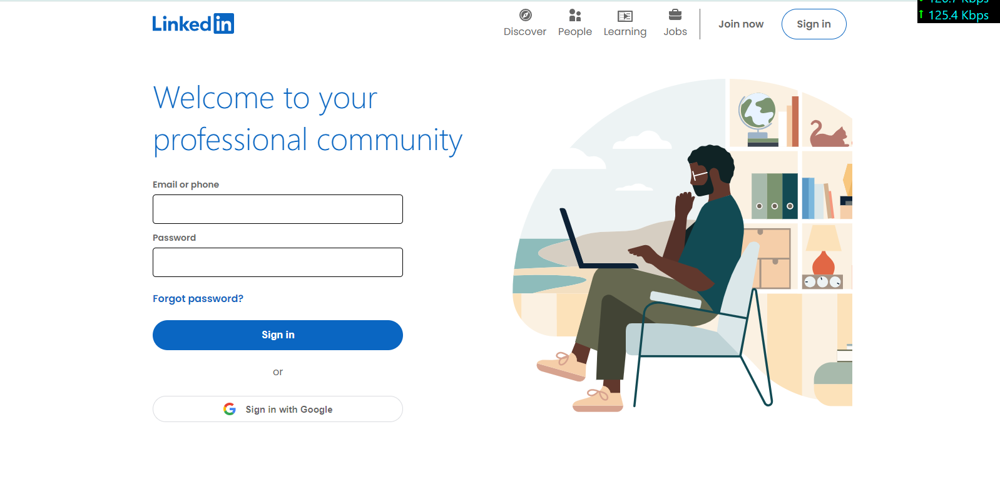
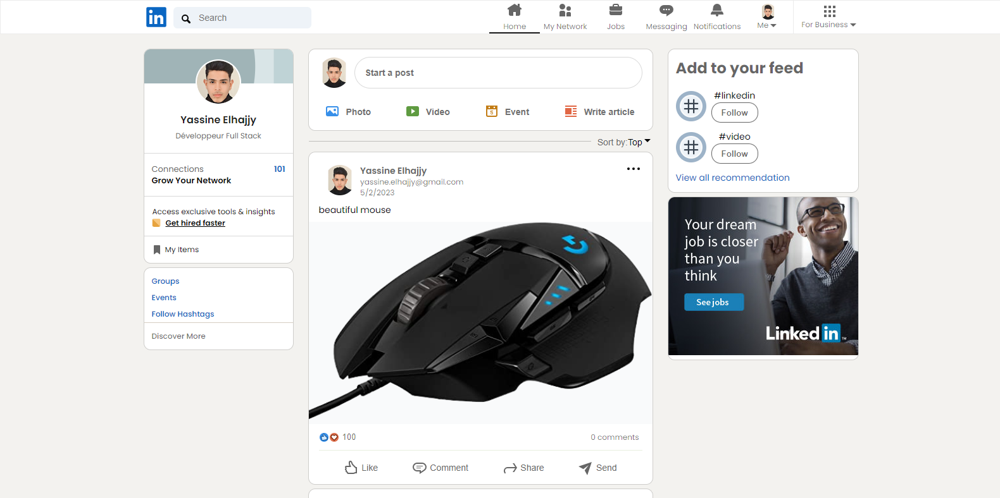

# Full-Stack-Linkedin-Clone

Built using React JS, Redux, Firebase & Styled-Components 

Put your credentials to  `.env` .

Run `npm run dev` to start application.

----

### Features and Fuctionality

<ul>
    <li>Login using Google (Firebase Authentication)</li>
    <li>Create a new post</li>
    <li>Share photos and videos (React player for videos)</li>
    <li>Auto authenticate user on refresh</li>
    <li>Sign Out</li>
    <li>Sort posts</li>
</ul>

----

### Preview

`Login page`

    

----

`Home page`

    

----

Give a :star: if you liked it. 
Made with :heart: and react JS.

